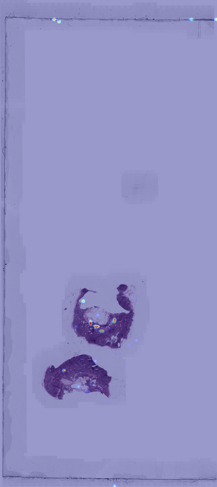
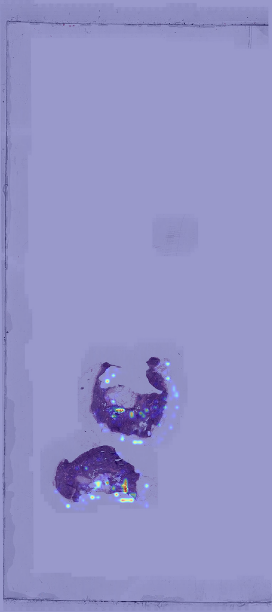
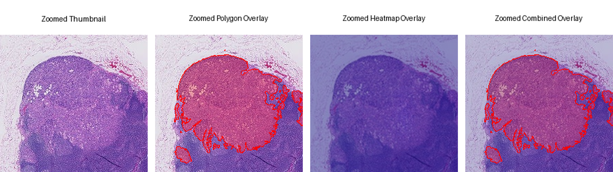

# WSI AI Prototype

A prototype for viewing and analyzing whole slide images (WSIs) in the browser.

This project combines FastAPI, OpenSlide, OpenSeadragon, and TIAToolbox to support:

- zero-footprint WSI viewing
- tile-based inference
- AI heatmap overlays
- click-to-inspect prediction results

This project is intended for research, learning, and portfolio demonstration. It is not clinically validated.

---

## Features

- Load large `.tif`, `.tiff`, and `.svs` pathology slides
- Stream WSI tiles on demand with FastAPI and OpenSlide
- View slides in the browser with OpenSeadragon
- Run tile-level inference with TIAToolbox PCam model
- Display AI heatmap overlay as a second tile layer
- Adjust heatmap opacity
- Click a region to inspect tile-level prediction details
- Use the viewer from a desktop or mobile browser
- Docker support for local reproducible runs

---

## Project Structure

```text
wsi-ai-prototype/
├── api/
│   ├── app.py
│   └── deepzoom.py
├── viewer/
│   └── index.html
├── scripts/
│   ├── extract_tiles.py
│   ├── run_inference_tiatoolbox.py
│   ├── generate_heatmap.py
│   └── download_dataset.sh
├── src/
├── data/
├── img/
├── Dockerfile
├── requirements.txt
└── README.md
```

Large slide files, extracted tiles, predictions, and generated outputs are excluded from Git.

---

## Zero-Footprint Viewer

The viewer runs in the browser and streams only the visible image tiles from the backend.

```text
Browser / OpenSeadragon
        ↓
FastAPI tile endpoints
        ↓
OpenSlide / DeepZoomGenerator
        ↓
WSI file on disk
```

The browser does not download the full slide. It requests tiles as the user pans and zooms.

Open the viewer at:

```text
http://localhost:8000/viewer
```

---

## Viewer Functions

The viewer supports:

- slide selection
- pan and zoom
- desktop navigator/minimap
- AI heatmap toggle
- heatmap opacity control
- run inference from the browser
- click-to-inspect prediction panel
- responsive mobile layout

The heatmap is served as transparent PNG tiles and displayed on top of the base WSI layer.

---

## Main API Endpoints

```text
GET  /viewer
GET  /docs

GET  /slides
GET  /slides/{slide_name}/info
GET  /slides/{slide_name}/dzi
GET  /slides/{slide_name}/tiles/{level}/{x}_{y}.jpeg

GET  /slides/{slide_name}/heatmap/info
GET  /slides/{slide_name}/heatmap-tiles/{level}/{x}_{y}.png
GET  /slides/{slide_name}/prediction-at?x={x}&y={y}

POST /slides/{slide_name}/infer
POST /predict
```

---

## Build Docker Image

```bash
docker build -t wsi-ai .
```

---

## Run Viewer with GPU

For CAMELYON slides:

```bash
docker rm -f wsi-ai-viewer 2>/dev/null || true

docker run --rm \
  --gpus all \
  -p 8000:8000 \
  -v "$(pwd)/data:/app/data" \
  -e SLIDE_ROOT=/app/data/raw/camelyon16/images \
  -e TIATOOLBOX_MODEL=resnet18-pcam \
  -e TIATOOLBOX_BATCH_SIZE=32 \
  -e TIATOOLBOX_DEVICE=cuda \
  --name wsi-ai-viewer \
  wsi-ai
```

Then open:

```text
http://localhost:8000/viewer
```

Swagger UI:

```text
http://localhost:8000/docs
```

---

## Run Viewer with TCGA SVS Files

Place `.svs` files under:

```text
data/raw/tcga/images/
```

Then run:

```bash
docker rm -f wsi-ai-viewer 2>/dev/null || true

docker run --rm \
  --gpus all \
  -p 8000:8000 \
  -v "$(pwd)/data:/app/data" \
  -e SLIDE_ROOT=/app/data/raw/tcga/images \
  -e TIATOOLBOX_MODEL=resnet18-pcam \
  -e TIATOOLBOX_BATCH_SIZE=32 \
  -e TIATOOLBOX_DEVICE=cuda \
  --name wsi-ai-viewer \
  wsi-ai
```

TCGA slides are useful for testing real `.svs` compatibility and viewer performance. AI heatmaps on non-CAMELYON slides should be treated as exploratory.

---

## Run on CPU

```bash
docker rm -f wsi-ai-viewer 2>/dev/null || true

docker run --rm \
  -p 8000:8000 \
  -v "$(pwd)/data:/app/data" \
  -e SLIDE_ROOT=/app/data/raw/camelyon16/images \
  -e TIATOOLBOX_MODEL=resnet18-pcam \
  -e TIATOOLBOX_BATCH_SIZE=16 \
  -e TIATOOLBOX_DEVICE=cpu \
  --name wsi-ai-viewer \
  wsi-ai
```

CPU mode works for testing but inference is slower.

---

## Manual Pipeline

Extract tiles:

```bash
python scripts/extract_tiles.py \
  --slide data/raw/camelyon16/images/tumor_005.tif
```

Run TIAToolbox inference:

```bash
python scripts/run_inference_tiatoolbox.py \
  --slide-id tumor_005 \
  --model resnet18-pcam \
  --batch-size 32 \
  --device cuda
```

Generate a static heatmap image:

```bash
python scripts/generate_heatmap.py
```

Typical outputs:

```text
data/processed/tiles/tumor_005/
data/interim/tile_index/tumor_005_tile_index.csv
data/processed/predictions/tumor_005_predictions.csv
data/processed/heatmaps/tumor_005_overlay.png
```

---

## Example Results

### Model Upgrade



*Before: non-pathology model with stronger edge and non-tissue artifacts.*



*After: TIAToolbox PCam model with activations more concentrated in tissue regions.*

### Ground Truth Comparison




---

## Data

Large data files are not included in this repository.

Expected local structure:

```text
data/
├── raw/
│   ├── camelyon16/images/
│   └── tcga/images/
├── interim/
│   ├── thumbnails/
│   ├── tissue_masks/
│   └── tile_index/
└── processed/
    ├── tiles/
    ├── predictions/
    └── heatmaps/
```

Download sample data:

```bash
./scripts/download_dataset.sh
```

---

## Notes on SVS Files

Some `.svs` files may not open with ImageMagick because of compression formats such as JPEG2000. That does not necessarily mean the file is invalid.

Use OpenSlide to check the file:

```bash
openslide-show-properties data/raw/tcga/images/example.svs
```

If OpenSlide can read it, the viewer should usually be able to stream it.

---

## Mobile Access

The viewer can be opened from another device on the same network:

```text
http://<linux-host-ip>:8000/viewer
```

This is useful for testing the zero-footprint workflow from a phone or tablet. Mobile viewing is intended for quick review and demo purposes, not primary diagnosis.

---

## Troubleshooting

### Container name already exists

```bash
docker rm -f wsi-ai-viewer
```

### Permission denied when deleting generated files

Docker may have created files as root.

```bash
sudo chown -R "$USER:$USER" data/processed data/interim
```

### Missing `libGL.so.1`

If TIAToolbox/OpenCV fails with `libGL.so.1`, install the needed system libraries in the Docker image:

```dockerfile
RUN apt-get update && apt-get install -y --no-install-recommends \
    openslide-tools \
    libopenslide0 \
    libgl1 \
    libglib2.0-0 \
    libsm6 \
    libxext6 \
    libxrender1 \
    && rm -rf /var/lib/apt/lists/*
```

Then rebuild:

```bash
docker build --no-cache -t wsi-ai .
```

### Heatmap does not show

Check that the prediction CSV exists:

```text
data/processed/predictions/{slide_id}_predictions.csv
```

You can also check:

```bash
curl http://localhost:8000/slides/{slide_name}/heatmap/info
```

---

## Clinical Status

This project is a research prototype. It is not clinically validated and should not be used for diagnosis.

The TIAToolbox PCam model is most relevant for CAMELYON-style lymph node slides. Results on other datasets, such as TCGA `.svs` files, should be treated as exploratory visualization.

---

## Roadmap

- background inference jobs
- progress status endpoint
- heatmap tile caching
- stronger model evaluation
- tumor segmentation branch
- DICOM WSI exploration
- React frontend version
